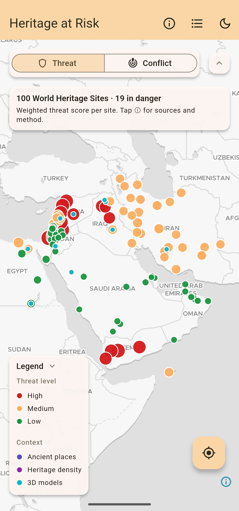
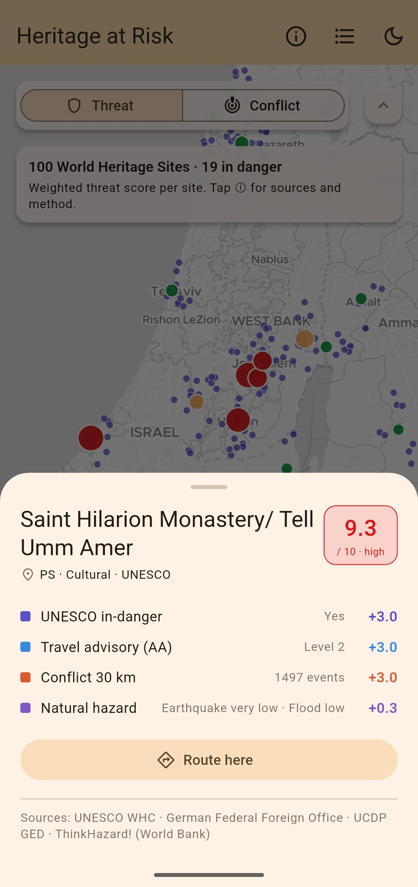
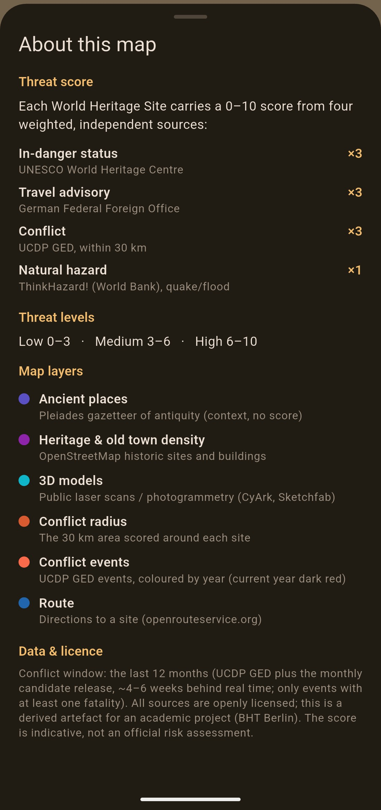
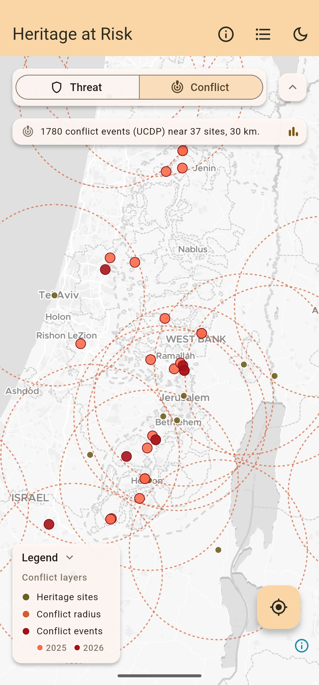
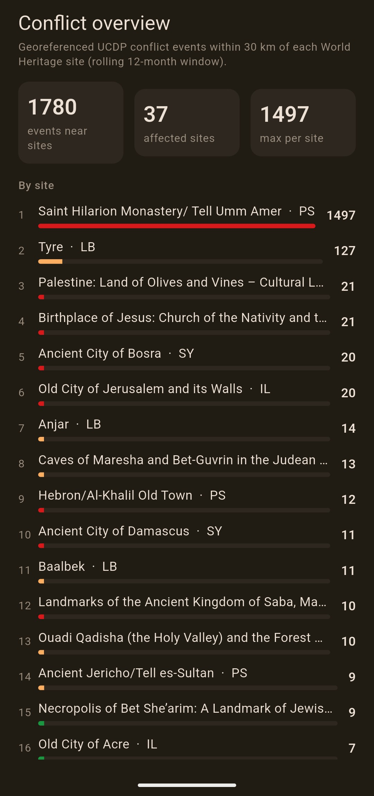
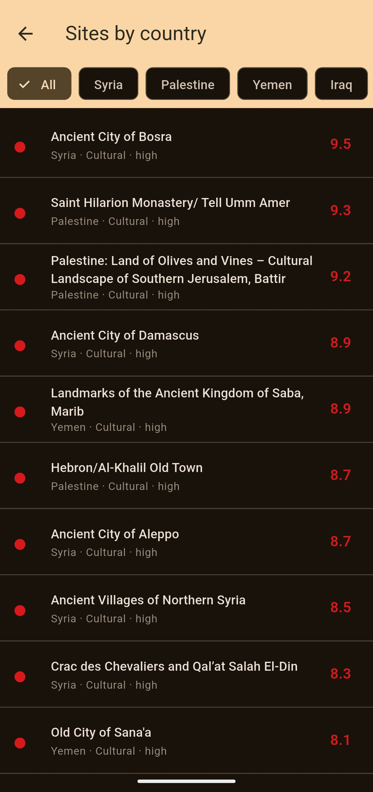
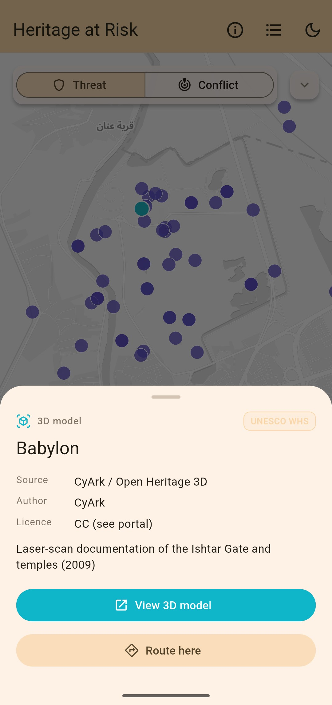
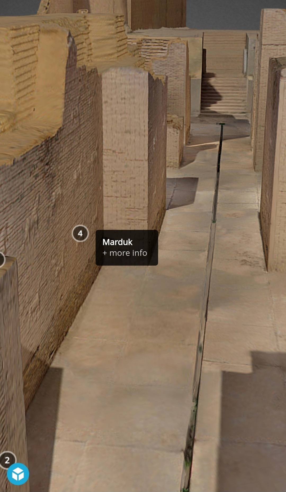
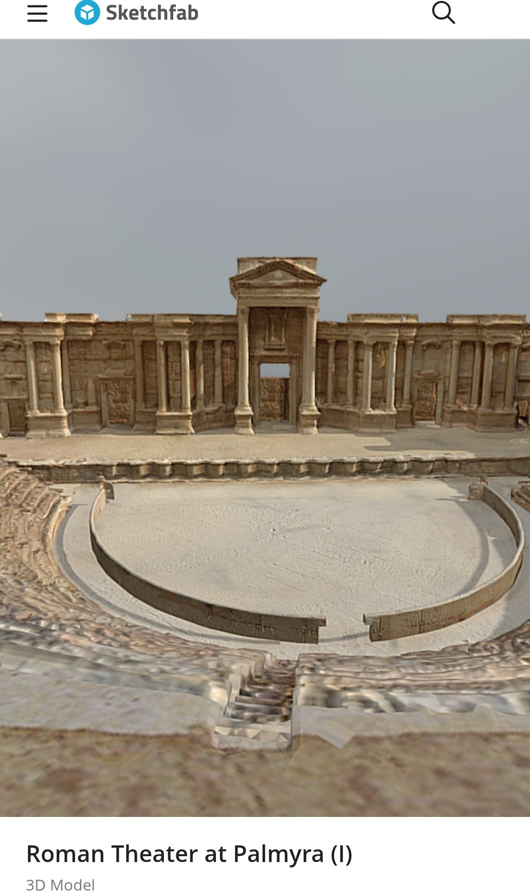
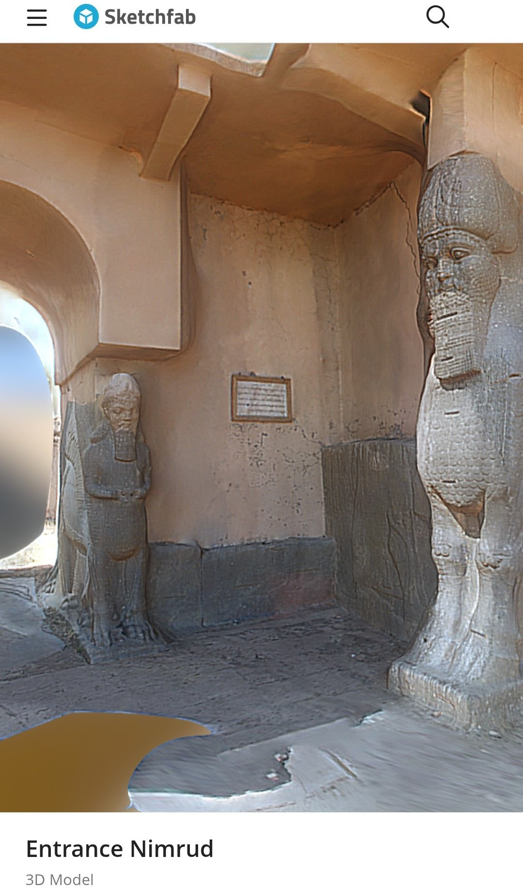

# HERITAGE AT RISK
### Threat mapping of UNESCO World Heritage and archaeological sites in the MENA region

© Sebastian Macherey, [github.com/sebastianmry/heritage-at-risk](https://github.com/sebastianmry/heritage-at-risk)

---

## App

Heritage at Risk renders the threat map with MapLibre Native over a MapTiler
`dataviz` basemap (light/dark variant). A segmented switch flips between
two views on the same map: **Threat** (the scored sites as an inverted
traffic-light ramp, high = red, plus 3D site markers, Pleiades ancient places
and a warm heritage/old-town density heatmap as context) and **Conflict**
(UCDP GED events, coloured by year, plus each site's 30 km evaluation
radius). Sites, Pleiades places, 3D markers and conflict events are all
tappable for a detail sheet; the legend filters threat classes and toggles
context layers, and a country-filtered list view ranks the sites by score and
jumps back to the map. On open, the camera fits the full extent of all sites
with a slim margin, so the map starts zoomed to the whole region instead of a
fixed default. Foreground geolocation centres the map on the user and reports
the nearest site. From there or from any site's, Pleiades' or 3D model's
detail sheet, **Route here** requests a live route (drive or walk) via the
OpenRouteService directions API and draws it on the map with distance and
duration. The app offers a light and a dark data-visualisation mode, switchable
at any time.

| Building block | Choice |
|---|---|
| Framework | Flutter (stable) + Dart 3 |
| Map engine | MapLibre Native (`maplibre_gl`) |
| Location | `geolocator` (foreground) |
| Routing | OpenRouteService directions API |
| State | Riverpod |

### Screenshots

<br>
Threat view, full extent

Detail sheets share one layout, for a scored site and for the info sheet:

<table>
<tr>
<td><br>Site detail, score breakdown</td>
<td><br>About this map (dark mode)</td>
</tr>
</table>

The Conflict view and its ranked overview:

<table>
<tr>
<td><br>Conflict view, 30 km radius</td>
<td><br>Conflict overview, ranked by events</td>
</tr>
</table>

<br>
Sites by country (dark mode)

<br>
3D model sheet

Three real reconstructions viewed in their external 3D viewers:

<table>
<tr>
<td><br>3D viewer, Babylon</td>
<td><br>3D viewer, Palmyra</td>
<td><br>3D viewer, Nimrud</td>
</tr>
</table>

---

## Motivation

Cultural heritage in the Middle East and North Africa is exposed to two forces at
once: armed conflict and political instability on one side, natural hazards such
as earthquakes and floods on the other. The losses of Palmyra, Aleppo and Mosul
showed how quickly irreplaceable sites can be damaged, driven in part by the
so-called Islamic State's deliberate, ideologically framed destruction of
pre-Islamic and rival-sect heritage (Isakhan & Zarandona, 2018), while the
ground reporting that would let anyone gauge the risk is scarce and slow. The
practical way to keep an overview is to combine open, public data sources into
a single, comparable signal per site.

Heritage at Risk is a mobile, location-based Android app (Flutter) that maps 100
UNESCO World Heritage Sites and archaeological sites across the MENA region.
Each site carries a spatially computed threat score from 0 to 10. Stable
countries appear with many low-scoring sites by design: the contrast lives at
the site level, so the map shows both the density and the threat of the
region's heritage.

---

## Study area

15 countries across the MENA region and the Gulf: Syria, Lebanon, Israel,
Palestine, Iraq, Iran, Yemen, Jordan, Egypt, Saudi Arabia, the United Arab
Emirates, Oman, Qatar, Bahrain and Kuwait (Kuwait has no UNESCO World Heritage
Site of its own but is kept for regional coverage). The selection deliberately
covers both a crisis core (Syria, Iraq, Yemen, Lebanon, Palestine) and stable
neighbours (the Gulf states, Jordan).

---

## Threat score

Four independent, public sources form the score (max 10). Three make up the human
threat axis, the fourth the natural hazard. The weights live centrally in
`config.py`.

| Component | Source | Weight |
|---|---|---|
| In-danger flag | UNESCO World Heritage Centre | 3 |
| Travel advisory level (0 to 2) | German Federal Foreign Office | 3 |
| Conflict events within 30 km (log-scaled) | UCDP GED (DuckDB `ST_Distance`) | 3 |
| Natural hazard (earthquake + river flood) | ThinkHazard! (World Bank GFDRR) | 1 |

The three human-threat components carry equal weight (3 each). The
natural-hazard component carries less weight (1) because it is a slower,
background risk rather than an acute, current one.

Colour alone never encodes the threat: the app and the artefacts also carry
the level and label as text, for accessibility. Only conflict events within
the 30 km evaluation radius of a site are counted and shown, so the events layer
matches exactly what the score counts. Combining independent, heterogeneous
open-data indicators into one weighted composite score follows established
disaster-risk-index practice, most closely the European Commission's INFORM
Risk Index (Marin-Ferrer et al., 2017).

---

## Data sources

- **UNESCO World Heritage Centre:** site list and the official *In Danger* flag.
- **German Federal Foreign Office:** travel advisory level (0 to 2) per country.
- **UCDP GED (Uppsala Conflict Data Program):** geocoded conflict events,
  counted within 30 km over a rolling 12-month window. The yearly GED release
  plus the monthly candidate dataset keep the data 4 to 6 weeks behind real
  time, so the score reflects the current situation. Openly licensed (CC BY
  4.0), peer-reviewed and citable.
- **ThinkHazard! / World Bank GFDRR:** earthquake and river-flood hazard per site.
- **Pleiades:** ancient places as historical context.
- **OpenStreetMap:** building and historic-object centroids near each site,
  aggregated into a weighted density grid for the heatmap.

All sources are openly licensed and redistributable. (An ACLED *Research*-tier
integration was evaluated in June 2026 and deliberately rolled back: its
12-month embargo on event-level data would have made the "current threat"
claim stale, and its licence would have forced the repository private. UCDP
GED is also the more reliable choice for this kind of fine-grained,
sub-national analysis (Eck, 2012). The comparison is documented in
`PROJECT_CONTEXT.md`.)

---

## Pipeline

Four separate stages, each with a defined input and output. Precompute instead
of computing live.

```
UNESCO WHC / AA / UCDP GED / ThinkHazard! / Pleiades / OSM
        |
        v
ingest_*.py                        # per source, shared logic in ingest_common.py
        |
        v
process.py (DuckDB)                # spatial join (30 km radius) + weighted score
        |
        v
export.py / export_events.py /     # GeoJSON artefacts -> artifacts/
export_radius.py / export_3d.py
        |
        v
app/ (Flutter)                     # reads only the finished artefacts
```

Raw data lives outside the repository under `DATA_DIR` (default
`../heritage_data`). Only derived artefacts and curated reference lists are
committed. See `PROJECT_CONTEXT.md` for notes on approaches that were
evaluated and dropped during development.

A GitHub Actions workflow (`.github/workflows/daily-update.yml`) refreshes the
time-critical sources daily (travel advisories and UCDP conflict events, plus
the small UNESCO inventory), recomputes the score and commits only the derived
artefacts, including the app's bundled `app/assets/data/*.geojson`. No secrets
are required; all sources are token-free. The heavy OSM and Pleiades context
layers stay static and are rebuilt manually.

---

## Data quality and caveats

- **The app does not pull data at runtime.** The GeoJSON artefacts are bundled
  as Flutter assets and compiled into the APK at build time. The workflow
  above keeps the *repository* current, but an already-built or downloaded APK
  only reflects the data as of its own build; it does not update itself. A
  fresh build is needed to pick up newer data.
- **UCDP GED only records events with at least one fatality.** Non-lethal
  incidents (intercepted drones, shelling without deaths) are not counted, so
  the conflict component is a lower bound on nearby violence, not a complete
  incident log.
- **The threat score is UNESCO-World-Heritage-Site-only by design.** Mosul's
  Old City (al-Nuri Mosque), Nimrud and Nineveh suffered severe destruction by
  the so-called Islamic State but are not inscribed World Heritage Sites (only
  on the Tentative List), so they carry no threat score; they still appear as
  unscored context in the 3D-model layer, badged accordingly.
- **The UNESCO danger-list flag comes from a curated, dated CSV, not the WHC
  API.** The `danger` field in the official WHC XML export is demonstrably
  incomplete (it lists only 1 of Syria's 6 officially endangered sites), so
  the authoritative in-danger flag is scraped once a year from the rendered
  danger list page instead and kept in `reference/`.
- **ThinkHazard! hazard levels are administrative-division granularity, not
  point estimates.** Each site is reverse-geocoded to its province/district
  and matched to that division's hazard report; there is no finer point
  lookup. The flood component in particular models river flooding, not flash
  floods, so it rates Yemen's mud-brick sites (Shibam, Zabid) lower than their
  real flood exposure. Proximity between mapped natural hazards and heritage
  sites is an established GIS analysis in the region, for example for the
  United Arab Emirates (Yagoub & Al Yammahi, 2022).

---

## Build

The app builds with the Android toolchain (Flutter 3.44, JDK 21, Android SDK 36);
`maplibre_gl` requires Java 21 source compatibility.

```sh
cd app
flutter pub get
flutter build apk --debug --dart-define=ORS_API_KEY=<your key> --dart-define=MAPTILER_KEY=<your key>
```

The OpenRouteService and MapTiler keys are injected at build time via
`--dart-define`. Without the ORS key the app still builds and runs: routing
explains how to enable it. The MapTiler key is required; the basemap has no
keyless fallback. On Windows,
`build_app.bat` in the repository root reads `OPENROUTESERVICE_API_KEY` and
`MAPTILER_API_KEY` from `.env` and passes both automatically. A ready-to-run
APK is attached to the repository's [Releases](https://github.com/sebastianmry/heritage-at-risk/releases)
if you just want to install it.

---

## Tech Stack

Python 3.12, DuckDB (spatial), GeoPandas, Shapely, pyproj, QuackOSM, pandas,
PyArrow, Requests, lxml; Flutter, Dart 3, MapLibre Native (maplibre_gl),
Riverpod, geolocator, url_launcher, http.

---

## References

- Eck, K. (2012). In data we trust? A comparison of UCDP GED and ACLED
  conflict events datasets. *Cooperation and Conflict, 47*(1), 124-141.
  https://doi.org/10.1177/0010836711434463
- Isakhan, B., & Zarandona, J. A. (2018). Layers of religious and political
  iconoclasm under the Islamic State: Symbolic sectarianism and
  pre-monotheistic iconoclasm. *International Journal of Heritage Studies,
  24*(1), 1-16. https://doi.org/10.1080/13527258.2017.1325769
- Marin-Ferrer, M., Vernaccini, L., & Poljansek, K. (2017). *INFORM index for
  risk management: Concept and methodology, version 2017* (Report No. EUR
  28655 EN). Publications Office of the European Union.
- Sundberg, R., & Melander, E. (2013). Introducing the UCDP Georeferenced
  Event Dataset. *Journal of Peace Research, 50*(4), 523-532.
  https://doi.org/10.1177/0022343313484347
- Yagoub, M. M., & Al Yammahi, A. A. (2022). Spatial distribution of natural
  hazards and their proximity to heritage sites: Case of the United Arab
  Emirates. *International Journal of Disaster Risk Reduction, 71*, Article
  102827. https://doi.org/10.1016/j.ijdrr.2022.102827

## Data licences and attribution

| Source | Licence |
|---|---|
| UNESCO World Heritage Centre | Public, cited per WHC terms of use |
| German Federal Foreign Office (travel advisories) | Public OpenData |
| UCDP GED (Uppsala Conflict Data Program) | CC BY 4.0 |
| ThinkHazard! (World Bank GFDRR) | CC BY 4.0 |
| Pleiades | CC BY 3.0 |
| OpenStreetMap (building density) | ODbL |
| MapTiler basemap | © MapTiler © OpenStreetMap contributors, shown via the in-app attribution control |
| OpenRouteService (routing) | © openrouteservice.org / HeiGIT, attribution shown in the route panel |

## License

MIT License (code). Bundled third-party data keeps its own licence, listed
above; the source citation for each lives in the metadata block of its
GeoJSON artefact.
